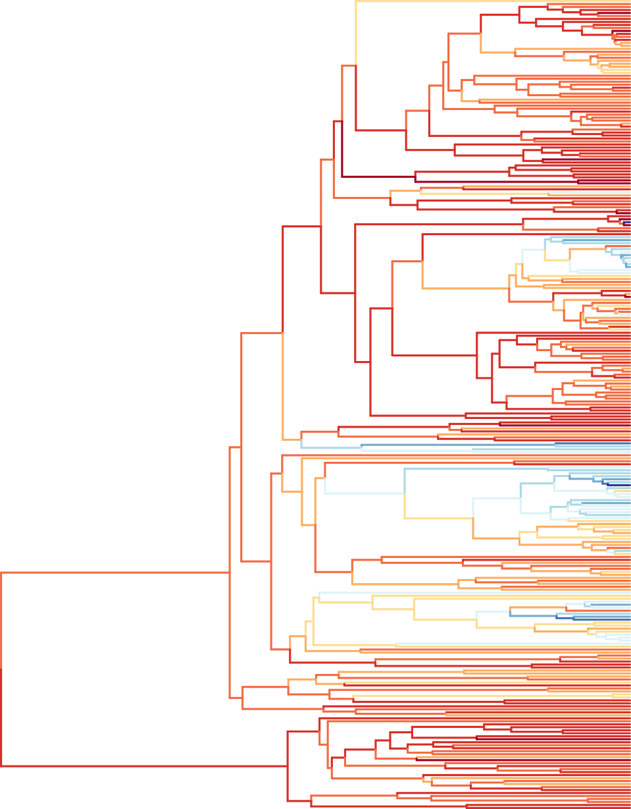
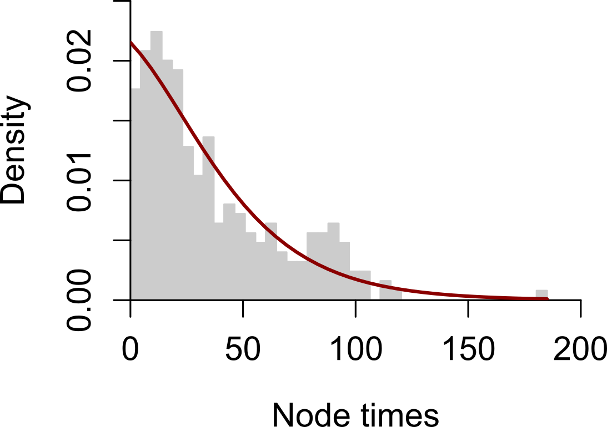

# R3F
An R package for molecular dates, rates, and priors using the relative rate framework.

## Installation
```
# Install via remotes.
# install.packages("remotes")
remotes::install_github("cathyqqtao/R3F")

# Alternatively, install via devtools. Note that manually installation of "Rtools" package may be required for successful use of devtools.  
# install.packages("devtools")
devtools::install_github("cathyqqtao/R3F")
```

## Troubleshooting
If you encounter an error messge saying that '.../library/R3F/R/R3F.rdb' is corrupt, please restart R or R session. 

## Usage
`rrf_rates(tree.name = "", type=c("NEWICK", "NEXUS"), outgroup = "", filename = "")` estimates relative lineage rates from a branch length tree using the relative rate framework (RRF). It outputs a table of relative lineage rates (\<filename\>_RRF_rates.csv) and a tree with relative rates (i.e., the branch lengths are relative rates) (\<filename\>_RRF_rates.nwk).

`rrf_times(tree.name = "", type=c("NEWICK", "NEXUS"), outgroup = "", filename = "")` estimates relative node times from a branch length tree using RRF. It outputs a table of relative node times (\<filename\>_RRF_times.csv) and a timetree (\<filename\>_RRF_times.nwk).

`rrf_rates_times(tree.name = "", type=c("NEWICK", "NEXUS"), outgroup = "", filename = "", plot = TRUE)` estimates relative node times from a branch length tree using RRF. It outputs a table of relative lineage rates and node times (\<filename\>_RRF_table.csv) and a timetree with relative rates labelled (\<filename\>_RRF_timetree.nexus). It also plots the timetree with branches colored by the relative rates, if `plot=TRUE`.

<p align="center">
	
</p>

`corrtest(tree.name = "", type=c("NEWICK", "NEXUS"), outgroup = "", sister.resample = 0, anchor.node = 0, anchor.time = 0, filename = "")` tests the hypothesis of independence of evolutionary rates among branches in a phylogeny. It outputs a CorrScore and the P-value for testing the null hypothesis of rate independence (\<filename\>_corrtest.txt). If non-zero `anchor.node` and `anchor.time` are specified, the mean and standard deviation of rates will be provided.

`ddbd(tree.name = "", type=c("NEWICK", "NEXUS"), outgroup = "", sampling.frac = 0, anchor.node = 0, anchor.time = 1, measure = c("SSE","KL"), filename = "", plot = TRUE)` estiamtes the values of parameters of Borth-Death speciation tree prior for downstream Bayesian dating analysis from a branch length tree. It outputs estiamted values of parameters in Birth-Death speciation model (\<filename\>_ddbd.txt). If the sampling.fraction is specified, only birth rate and death rate will be estimated. Otherwise, all three parameters will be estimated. A histogram of node times and a density curve of the estimated parameters of Birth-Death model will be plotted, if `plot=TRUE`. 

<p align="center">
	
</p>

`tree2table(tree.name = "", type=c("NEWICK", "NEXUS"), time = TRUE, filename = "")` converts a tree in NEWICK or NEXUS format to a table (.csv).

## References
K. Tamura et al. Mol. Biol. Evol. (2018) 35:1770-1782. doi:[10.1093/molbev/msy044](http://doi.org/10.1093/molbev/msy044).

Q. Tao et al. Mol. Biol. Evol. (2019) 36:811-824. doi:[10.1093/molbev/msz014](https://doi.org/10.1093/molbev/msz014).

Q. Tao et al. Bioinformatics (2021) 37:i102-i110. doi:[10.1093/bioinformatics/btab307](http://doi.org/10.1093/bioinformatics/btab307).

## Notes
Example tree is inferred using empirical sequences in dos Reis et al. (2012).
